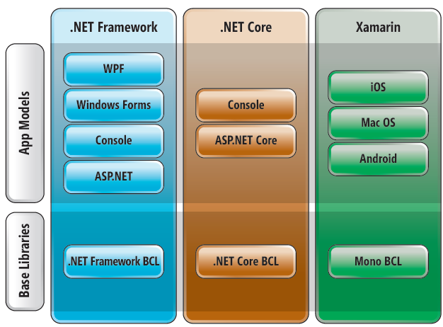

## C# e .NET

https://www.microsoft.com/net/learn/what-is-dotnet

• C# : uma linguagem de programação (regras sintáticas). 

• .NET (2002): uma plataforma de desenvolvimento para se criar diversos tipos de aplicações, podendo usar várias linguagens de programação.

### .NET

https://www.microsoft.com/net/download

https://docs.microsoft.com/pt-br/dotnet/framework/migration-guide/how-todetermine-which-versions-are-installed

• BCL - Base Class Library https://msdn.microsoft.com/en-us/library/gg145045(v=vs.110).aspx

• CLR - Common Language Runtime (Máquina Virtual). Similar a JVM em Java.
> Nota: possui garbage collection (objetos não utilizados são automaticamente desalocados da memória)

### CLI e Bytecode

A Common Intermediate Language (ou CIL) é uma linguagem de programação de baixo nível do ambiente de programação da Microsoft. O código de mais alto nível do ambiente .NET Framework é compilado em código CIL, que é assemblado em código chamado bytecode. CIL é um código orientado a objeto e executado por uma máquina virtual.

Bytecode é o resultado de um processo semelhante ao dos compiladores de código-fonte que não é imediatamente executável. Em oposição, o bytecode irá ser interpretado numa máquina virtual, que fará a execução.

### Modelo de execução 

Dev escreve o cód. -> compilação [gera um cód. na linguagem intermediária CLI] -> cód. será executado no CLR [cód de máquina]. 

